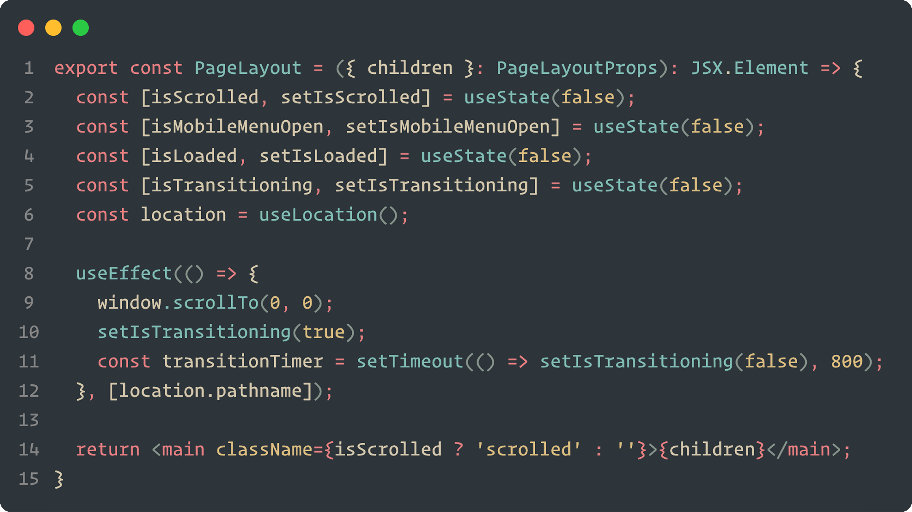
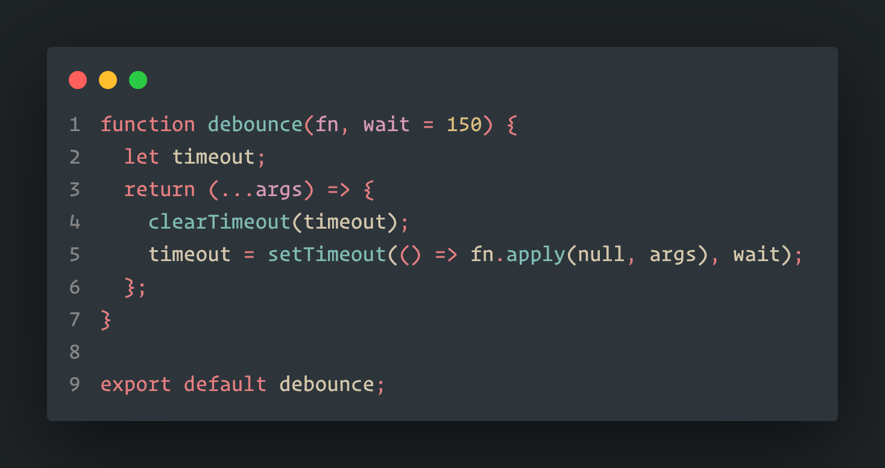
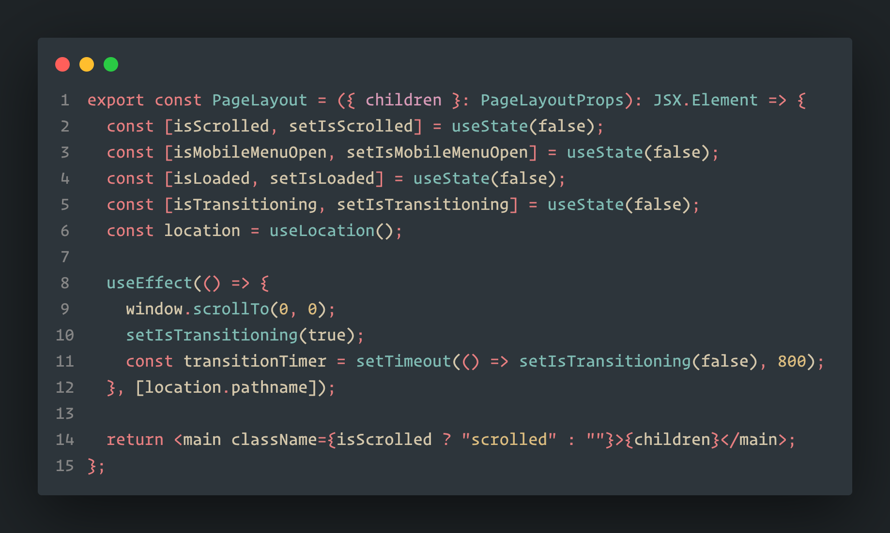
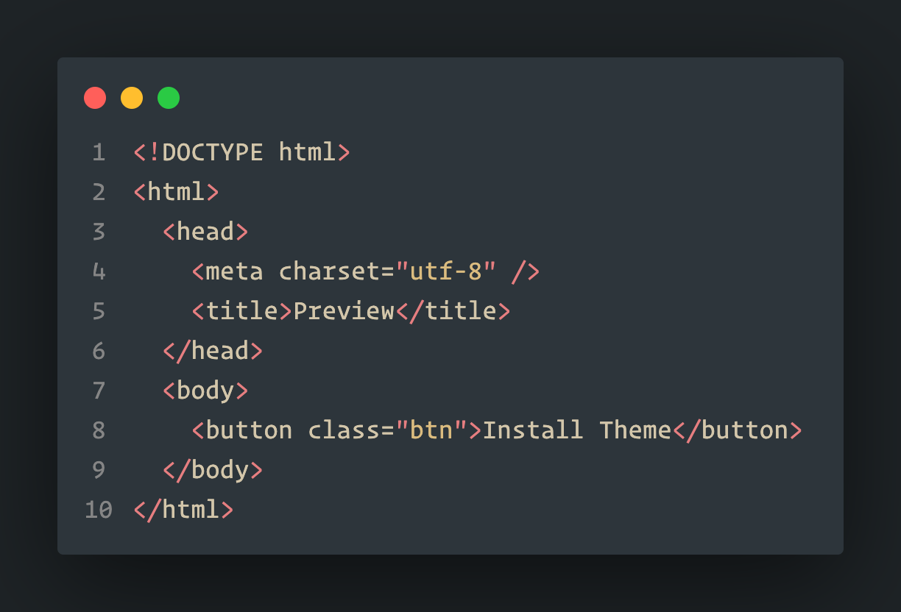
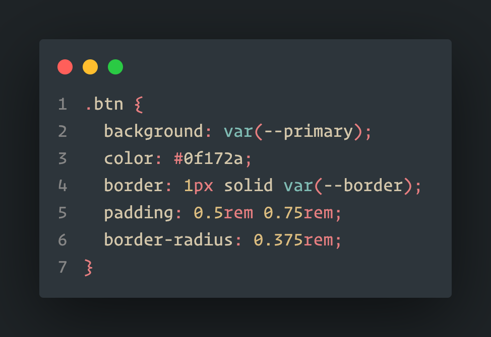

# Forest Night Theme

A beautiful dark theme for Visual Studio Code inspired by the tranquility of forest nights.

## Preview

The Forest Night theme provides a consistent and beautiful experience across different programming languages:

### TypeScript

### JavaScript

### TSX/React

### Python

### HTML

### CSS

## Installation

1. Clone this repository.
2. Open the folder in VS Code.
3. Press `F5` to launch an Extension Development Host with the theme.

## Features

- Dark color palette
- Soothing green and blue tones

## License

See [LICENSE](LICENSE) for details.
